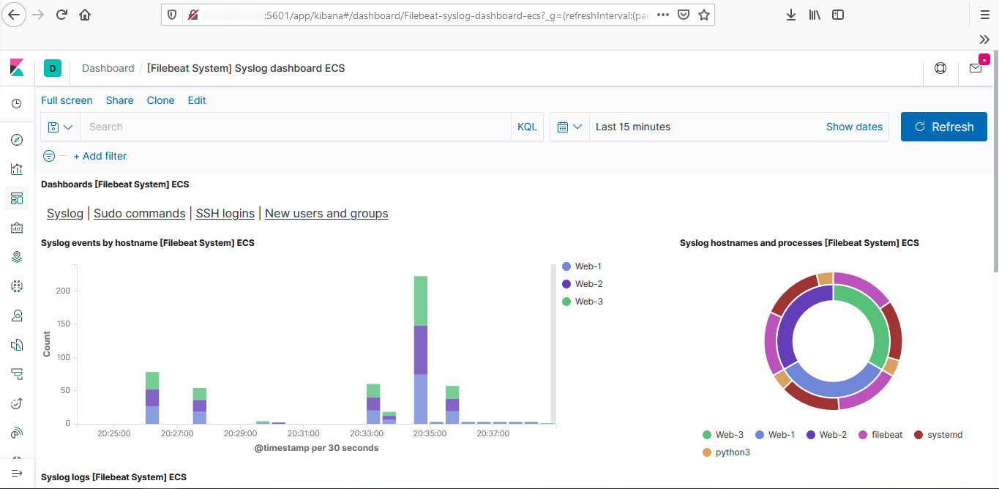

## Automated ELK Stack Deployment

The files in this repository were used to configure the network depicted below.

These files have been tested and used to generate a live ELK deployment on Azure. They can be used to either recreate the entire deployment pictured above. 

This document contains the following details:
- Description of the Topology
- Access Policies
- ELK Configuration
  - Beats in Use
  - Machines Being Monitored
- How to Use the Ansible Build

### Description of the Topology

The main purpose of this network is to expose a load-balanced and monitored instance of DVWA, the D*mn Vulnerable Web Application.

Load balancing ensures that the application will be highly available, in addition to restricting incoming access to the network.

Integrating an ELK server allows users to easily monitor the vulnerable VMs for changes to the filesystems and system metrics of the VMs on this network.

The configuration details of each machine may be found below.

| Name       | Function        | IP Address | Operating System |
| ---------- | --------------- | ---------- | ---------------- |
| Jump Box   | Gateway         | 10.0.0.5   | Linux            |
| Web-1      | DVWA Web Server | 10.0.0.6   | Linux            |
| Web-2      | DVWA Web Server | 10.0.0.7   | Linux            |
| Web-3      | DVWA Web Server | 10.0.0.8   | Linux            |
| ELK-Server | Elk Server      | 10.1.0.4   | Linux            |

Load Balancers: Red-Team-LB
	Availability Zone 1: Web-1, Web-2, Web-3
	Availability Zone 2: ELK-Server

### Access Policies

The machines on the internal network are not exposed to the public Internet. 

Only the Jump-Box machine can accept connections from the Internet. Access to this machine is only allowed from the following IP address:
- 148.64.108.46

Machines within the network can only be accessed by each other. The web server VMs can be accessed through SSH by the Jump-Box and send logs to the ELK-Server

A summary of the access policies in place can be found in the table below.

| Name       | Publicly Accessible | Allowed IP Addresses                |
| ---------- | ------------------- | ----------------------------------- |
| Jump-Box   | Yes                 | 148.64.108.46                       |
| Web-1      | No                  | 10.0.0.0/23                         |
| Web-2      | No                  | 10.0.0.0/23                         |
| Web-3      | No                  | 10.0.0.0/23                         |
| ELK-Server | No                  | 10.0.0.0/23 148.64.108.46:5601 |

### Elk Configuration

Ansible was used to automate configuration of the ELK machine. No configuration was performed manually, which is advantageous because manual configuration is prone to human error.

The playbook implements the following tasks:
- Install Docker
- Install pip3
- Install the Docker python module
- Increase the virtual memory available
- Download & launch the Docker ELK container

The following screenshot displays the Kibana dashboard after the ELK server has been successfully configured and is receiving logs

### Target Machines & Beats
This ELK server is configured to monitor the following machines:
| Name  | IP       |
| ----- | -------- |
| Web-1 | 10.0.0.6 |
| Web-2 | 10.0.0.7 |
| Web-3 | 10.0.0.8 |

We have installed the following Beats on these machines:
- **Filebeat**
- **Metricbeat**

These Beats allow us to collect the following information from each machine:
- Filebeat detects changes to the filesystem. Specifically, we use it to collect Apache logs. These might look something like: `127.0.0.1 - - [31/Aug/2020:14:07:36 -0700] "GET	/dvwa HTTP/1.1" 301 574      "-" "Mozilla/4.08 [en]	(Windows NT 10.0; Win64; x64)"`
- Metricbeat detects changes in system metrics, such as CPU usage. We use it to detect SSH login attempts, failed `sudo` escalations, and CPU/RAM statistics. These might look something like: `2017-12-17T18:54:16.242-0500	INFO	[example]	logp/core_test.go:16	some message`

### Using the Playbook
In order to use the playbook, you will need to have an Ansible control node already configured. Assuming you have such a control node provisioned: 

SSH into the control node and follow the steps below:
- Copy the playbook file to the Ansible control node.
- Update the `filebeat-config.yml` file to include the IP address of the ELK server and create a `hosts` file to specify the VMs on which each playbook is run.
- Run the playbook, and navigate to port 5601 at address of your ELK server to check that the installation worked as expected (In the diagramed example, this would be `10.1.0.4:5601`)

